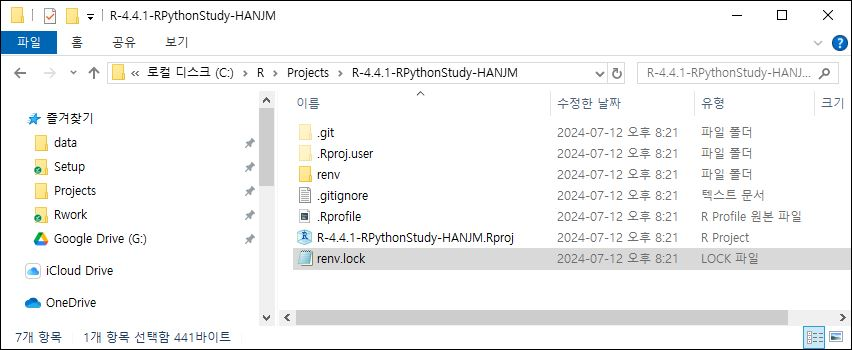

### R 설치

CRAN (The Comprehensive R Archive Network, <https://cran.r-project.org/index.html>)에서 자신의 운영체제에 맞는 최선 버전을 다운로드 받아 설치합니다.

윈도우의 경우 설치폴더는 R 버전이 4.4.0이면 default로 C:\\Program Files\\R\\R-4.0.0로 되지만 C:\\R\\R-4.4.0을 추천합니다.

-   `C:\Program Files` 폴더 하에 설치: 대부분의 Windows 애플리케이션은 `program Files` 폴더에 설치되므로 시스템 소프트웨어와 애플리케이션을 관리하는 표준 위치이기 때문에 시스템의 정리가 용이합니다. 또한 `Program Files` 폴더는 특별한 시스템 권한을 요구하므로 일반 사용자가 이 폴더 내의 파일을 쉽게 변경할 수 없으므로, 악의적인 소프트웨어에 의한 변경으로부터 보호할 수 있습니다. 그러나 R 패키지를 설치하거나 업데이트할 때마다 관리자 권한이 필요하여 사용자가 R을 자유롭게 사용하고자 할 때 불편을 초래할 수 있고 \``` Program Files` ``는 경로 내에 공백을 포함하고 있어 일부 오래된 스크립트나 도구에서는 경로 내의 공백을 제대로 처리하지 못할 수 있어 문제가 발생할 수 있습니다.

-   `C:\` 하부에 직접 설치 (예: `C:\R`): 패키지 설치나 업데이트 시 관리자 권한을 요구하지 않고, 경로에 공백이 없기 때문에, 모든 스크립트나 프로그램에서 호환성 문제 없이 이 경로를 사용할 수 있습니다. 그러나 사용자 권한으로 설치된 프로그램은 보안이 상대적으로 약할 수 있으며, 악의적인 소프트웨어에 의해 변경되기 쉽고, 표준 설치 위치를 사용하지 않는 경우, 시스템의 소프트웨어와 애플리케이션이 분산되어 관리가 어려워질 수 있습니다.

-   결론적으로, 설치 위치를 선택할 때는 보안, 사용 편의성, 시스템 관리의 용이성 등을 고려해야 하는데, 개인 사용자나 개발 환경에서는 `C:\R`과 같은 사용자 지정 경로가 더 편리할 수 있으며, 기업 환경이나 보안이 중요한 상황에서는 `C:\Program Files` 폴더 하에 설치하는 것이 더 적합할 수 있습니다.

설치완료 후에는 시스템환경변수에 R 실행파일경로를 지정해 두어야 합니다.

-   사용자나 RStdio와 같은 프로그램에서 R을 호출할 때나 package등을 설치할 때 시스템에서 R 실행파일의 설치경로를 알아야 원할히 진행됩니다.

-   Win+R로 실행창을 열고 sysdm.cpl 을 입력하는 방식이 빠르며, 시스템속성 고급탭에서 환경변수를 선택한 후 시스템변수 목록에서 path를 선택한 후 새로만들기 또는 편집으로 R 실행파일의 경로를 지정해 주시면 됩니다.

-   지정 후 확인은, Win+R로 실행창을 열고 cmd 입력하여 커맨드창을 열고 "R" 또는 "R —version"을 입력하여 화면의 버전을 확인하시면 됩니다.

### Rtools 설치

Rtools는 R 프로그래밍 언어와 관련된 개발 도구 모음으로, 주로 Windows 운영 체제에서 사용됩니다. Rtools의 주요 역할과 기능은 다음과 같습니다:

-   **패키지 컴파일 및 설치**: R 패키지를 설치하거나 업데이트할 때, 특히 CRAN에서 제공하는 패키지 중 일부는 소스 코드 형태로 제공됩니다. 이 경우 Rtools는 해당 소스 코드를 컴파일하여 설치할 수 있도록 도와줍니다.

-   **GNU 빌드 도구 제공**: Rtools는 GCC(gnu 컴파일러 컬렉션), make, tar, git 등과 같은 GNU 빌드 도구를 포함하고 있어, Windows 환경에서도 리눅스와 유사한 빌드 환경을 제공합니다.

-   **R 패키지 개발 지원**: R 패키지를 개발하는 과정에서 필요한 다양한 도구와 라이브러리를 제공합니다. 특히, C/C++ 코드와 연동되는 R 패키지를 개발할 때 유용합니다.

-   **명령줄 도구**: 명령줄에서 R 및 관련 작업을 수행할 수 있는 도구들을 제공합니다. 이를 통해 보다 정교하고 복잡한 작업을 자동화할 수 있습니다.

Rtools의 설치파일도 역시 CRAN에서 다운로드 하시면 되고, 설치폴더는 C 드라이브 루트가 권장됩니다 (예시 C:\\rtools44). 시스템환경변수에서 Rtools 실행파일의 경로설정은 설치과정에서 자동으로 됩니다. (안되어 있으면 수동으로 설정하시길 바랍니다.) 시스템환경변수에 실행파일의 경로설정 확인은 R 콘솔에서 Sys.which("make") 실행하여 설치경로를 제대로 반환하면 성공임을 알 수 있습니다.

### R 통합개발환경 (Integrated Development Enviroment, IDE) 선택

RStudio와 VS Code는 모두 각자의 특징을 가진 R 프로그래밍을 위한 통합 개발 환경(IDE)입니다. RStudio는 전용화된 환경으로 R 언어와 관련된 다양한 기능을 직관적으로 제공하며, R 코드 작성, 데이터 시각화, 리포팅 등에 최적화되어 있습니다. 반면에 VS Code는 다양한 프로그래밍 언어를 지원하며, Marketplace에서 제공하는 확장 기능을 통해 개발자가 필요한 기능을 추가할 수 있는 유연성을 가지고 있습니다. VS Code는 경량화된 성능과 통합 터미널 기능을 제공하여 다양한 개발 환경에서 활용될 수 있지만, R에 특화된 기능은 상대적으로 부족할 수 있습니다.

연구회에서는 RStudio를 우선 추천합니다.

#### RStudio 설치

자신의 운영체제에 맞는 최신버전의 RStudio를 아래의 공식 다운로드 사이트에서 다운로드 후

```{r RStudio_download_site, eval=FALSE, filename="POSIT사 다운로드사이트"}
https://posit.co/downloads/
```

default 폴더에 설치합니다.

Tools 메뉴 \> Global Options... \> R General \> Basic 탭에서

R version은 아래의 예시와 같이 설치하신 최신버전의 R 실행경로를 선택해 주시면 됩니다.

```{r RStudio_R_version, eval=FALSE, filename="R version: 예시"}
[64-bit] C:\R\R-4.4.1
```

Default working directory 지정은 아래의 예시와 같이 프로젝트를 관리하는 상위 폴더를 추천 드립니다.

```{r RStudio_R_wd, eval=FALSE, filename="Default working directory: 예시"}
C:\R\Projects
```

### Github

Git는 로컬 버전 관리 시스템으로 개발 중인 소스코드의 변경 내역을 쉽게 추적하고 관리할 수 있게 해줍니다. 물론 R에 한정된 것이 아니며 범용적입니다.

Github는 클라우드 개념의 원격저장소를 통해 자신의 프로젝트 버전관리를 하게되며, 여러 개발자가 동일한 프로젝트에서 작업할 수 있도록 브랜치를 만들어 독립적으로 개발한 후, Pull Request를 통해 코드를 병합할 수도 있습니다. R로 통계 프로젝트를 할 때, git 설치가 반드시 필요한 것은 아닙니다. 하지만 제가 만든 예제 R프로젝트가 github 원격저장소에 보관되어 있으므로 git의 설치가 추천됩니다. 만약에 git의 사용이 어려우신 분들은 github 원격저장소를 클라우드처럼 생각하시고 필요한 파일들을 직접 하나씩 다운로드 받으셔도 됩니다.

#### Git 설치

Git 공식 사이트에서 자신의 운영체제에 맞는 설치파일로 default 폴더에 설치하시면 됩니다.

```{r git_download_site, eval=FALSE, filename="Git 설치파일 다운로드 사이트"}
https://git-scm.com/downloads
```

확인은 커맨드창에서 "git –version"을 실행하여 버전이 맞는지 확인하면 됩니다.

```{r git_installation, eval=FALSE, filename="Command"}
git -–version
```

다음으로 사용자이름과 이메일 주소를 아래의 git 명령으로 설정해야 합니다. Git은 로컬저장소에서 원격저장소로 파일을 갱신시킬 떄 등에서 (구체적으로는 커밋할 때) 이 정보를 사용하게 됩니다. 저의 경우에는 제가 github에 가입했던 name과 email로 설정하였습니다.

```{r git_config_user.name, eval=FALSE, filename="uer.name 설정예시"}
git config --global user.name "BenKorea"
```

```{r eval=FALSE, filename="uer.email 설정예시"}
git config --global user.email "kimbi.kirams@gmail.com"
```

버전관리를 시작할려면 원하는 폴더 (=프로젝트 폴더)에서 git init 명령어를 실행하면 됩니다. 하지만

#### **패키지 종속성 관리를 위한** `renv`

원래 R에서 패키지는 해당버전 R의 설치폴더 하부의 library 폴더에 설치됩니다. `renv`는 R 프로젝트에서 패키지 의존성을 관리하기 위해 설계된 도구로써, renv를 설치하고 활성화하면 해당 프로젝트 폴더 하부에 renv 폴더가 만들어지고, 그 하부에 패키지를 설치하게 됩니다. 또한 설치된 패키지들의 정보를 renv.lock 파일에 관리하게 됩니다. 이러한 방법으로 R에서는 프로젝트별로 패키지를 관리할 수 있으므로 필자를 이를 추천합니다.

RStudio에서 새로운 프로젝트를 생성할 때 renv 사용여부를 check하면 자동으로 설정됩니다.

### **R & RStudio 폴더관리 추천**

#### 실행파일 설치 폴더

R 새 버전으로 업데이트하면 드물겠지만 기존 코드나 사용 중인 패키지가 예상대로 작동하지 않을 수 있으며, 새 버전에서는 패키지의 지원이 변경될 수 있어 시스템의 안정성을 유지하기 위해 이전 버전의 실행파일을 유지하는 것도 필요합니다. 따라서 아래의 예시와 같은 폴더구조가 추천됩니다.

C:\\R

├── R-4.4.0

└── R-4.4.1

#### 프로젝트 폴더관리

R 실행파일을 C 드라이브 R 폴더 하위에 설치한 것을 고려하면 Project 폴더를 C:\\R\\Projects 하위폴더에 R 버전과 프로젝트명을 폴더명으로 하여 관리하는 것을 추천합니다.

C:\\ R

├── R-4.4.0

├── R-4.4.1

└── Projects

\|

\| └── R-4.4.1-RPythonStudy_Website

### 예제 R프로젝트 다운로드

#### 1. RStudio 프로젝트 만들기

New Project... \> New Directory \> New Project를 단계적으로 선택하고

C:\\R\\Projects (=Default working directory) 하위에

Directory name 입력란에는 아래의 예시와 같이 R의 버전과 프로젝트를 상징하는 이름을 조합하여 입력할 것을 추천합니다.

```{r R_new_project, eval=FALSE, filename="예시"}
R-4.4.1-RPythonStudy_HANJM
```

git repository(=저장소) 만들기와 renv 사용하기 check box는 예제 R프로젝트를 다운로드 하기 위해서는 선택해야 합니다.

이제 탐색기로 프로젝트 폴더(C:\R\Projects\R-4.4.1-RPythonStudy-HANJM)를 살펴보면 .git 폴더, .Rproj.user 폴더, renv 폴더, .gitignore 파일, .Rprofile 파일, R-4.4.1-RPythonStudy-HANJM.Rproj 파일, renv.lock 파일들이 생성되었음을 확인하실 수 있습니다.



git를 사용하기 때문에 설정이 보관되는 .git 폴더와 버전관리 예외(규칙)이 기록되어 있는 .gitignore 파일이 생성되어 있습니다. renv를 사용하기 때문에 프로젝트에 패키지가 설치되는 renv 폴더가 생성되었고 설치되는 패키지의 대한 기록이 되는 renv.lock 파일 생성되어 있습니다. RStudio에서 프로젝트로 이 폴더를 사용하기 때문에 .Rproj.user 폴더, .Rprofile 파일, R-4.4.1-RPythonStudy-HANJM.Rproj 파일이 생성되어 있습니다.

#### 2. Git 원격저장소 예제 R프로젝트 파일 다운로드

아래는 github 원격저장소에 있는 생존분석데이터를 이용한 샘플용 R프로젝트를 나의 R 프로젝트 폴더에 다운로드 받는 방법입니다.

먼저 현재의git 프로젝트에 github 원격저장소의 URL을 등록해야 합니다. Git 명령을 입력하기 위해 아래의 그림의 console pane의 Terminal 탭으로 이동하여 git remote add 명령을 실행합니다.


```{r github_remote_add, eval=FALSE, filename="Terminal"}
git remote add origin https://github.com/RPythonStudy/HANJM.git
```

그리고 다운로드 준비를 해야 하는데 git pull 명령으로 원격저장소의 모든 파일을 다운로드 할 예정인데 로컬 폴더에 중복되는 파일이 하나라도 있으면 오류가 발생하므로, 중복이 되는 파일인 .gitignore 와 renv.lock 을 로컬 프로젝트폴더에서 삭제해 줍니다.

이후 아래의 git 명령으로 원격저장소의 모든 파일을 다운로드 받아 주면 됩니다.

```{r github_pull, eval=FALSE, filename="Terminal"}
git pull origin master
```

(중복이 있더라도 원격저장소으 파일로 강제로 덮어쓰는 명령이 있지만 제가 시도할 때는 오류 메세지가 같이 나오기 때문에 일단 여기에는 소개하지 않습니다.)

#### 3. renv.lock 파일로 R package 설치하기

원격저장소에는 예제 R프로젝트 파일은 있지만 이를 위해 필요한 R 패키지까지 같이 있지는 않습니다. 하지만 renv.lock 파일에는 설치된 패키지 버전과 목록이 기록되어 있으므로 이를 이용해서 설치하시면 됩니다.

Console pane의 Consle 탭으로 이동해서 renv::restore() 명령을 실행하시면 됩니다.

```{r renv_restore, eval=FALSE, filename="Console"}
renv::restore ()
```

예제R프로젝트를 실행할 때 raw data로써 "deidentified_han20230213.csv"이 필요합니다. 이 파일은 이미 개인정보보호조치(개인정보익명화, 날짜정보를 날짜간의 차이정보로 변환)가 되어 있지만 연구회의 방침상 업로드는 되어 있지는 않습니다. 내부연구자 분들이 실습을 위해 위 파일이 필요한 경우에는 연구회에 연락 바랍니다. 이 파일을 프로젝트 폴더 하부의 raw_data 폴더를 만들고 위 csv 파일을 복사해 주시면 됩니다.
