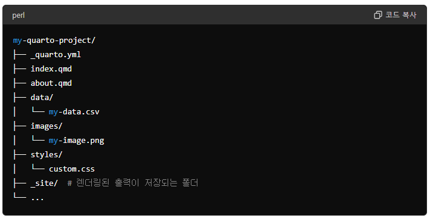
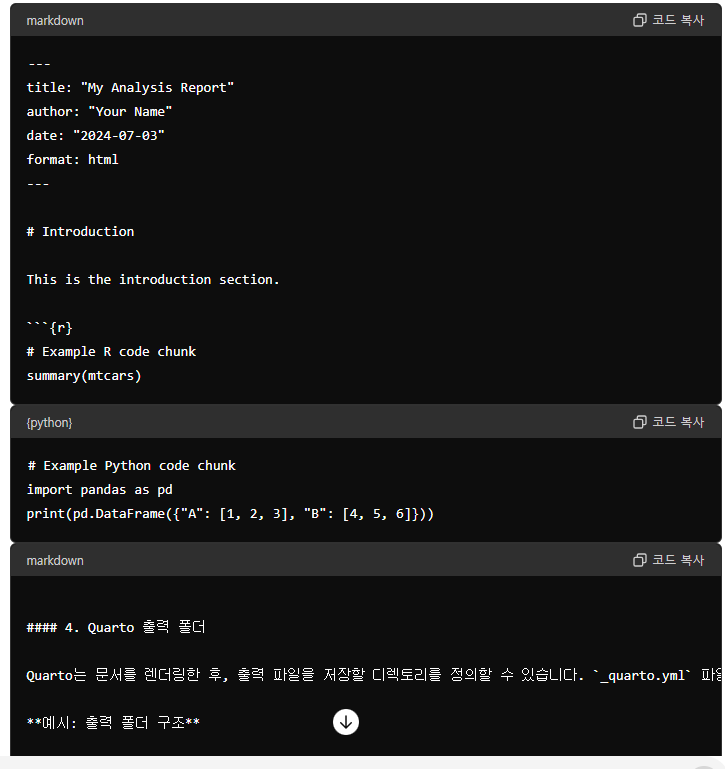
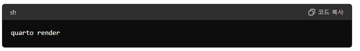
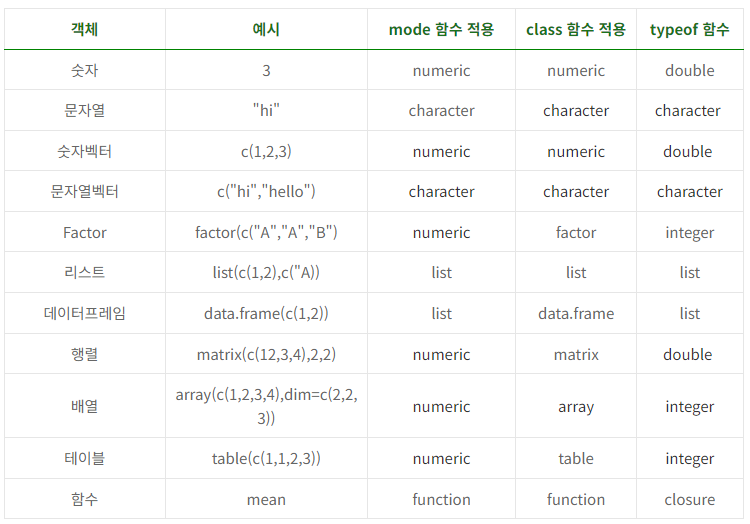

### RStudio에서 R 스크립트 실행결과를 논문에서 사용하는 방법

RStudio에서 \*.R로 생성되는 R 스크립트 파일 내의 특정부분 스크립트를 실행하면 Console pane에서 결과를 확인할 수 있습니다. 그래픽 출력은 Output pane에 위치한 Plots 창에서 볼 수 있으며, HTML 위젯이나 대화형 문서는 Viewer 창에서 확인 가능합니다. 변수와 데이터셋의 현재 상태는 Environment 창에서 볼 수 있고, 스크립트나 함수가 생성하거나 수정한 파일은 Files 탭을 통해 접근할 수 있습니다.


논문에서 그래프를 사용하고 싶다면 Output pane의 Plots 탭에서 Export 하거나 스크립트에서 특정 테이블이나 그래프를 파일로 저장하여 사용하게 됩니다.

### R Markdown

R Markdown은 markdown이라는 문서작성 언어로 작성된 문서 내에 R 코드가 포함된 것으로, R 코드 결과물이 문서의 지정된 부위에 생성되는 개념입니다. 이를 논문작성에 적용하면 작성중인 논문 데이터의 오류를 정정하였을 때 R Markdown에서는 이미 작성한 그래프나 테이블을 연결되어 수정되며 이는 큰 장점입니다.

### Quarto

R Markdown이 주로 R 만 지원하고 출력형식이 제한적이지만 최근에 개발된 Quarto는 R 이외에도 Python 등 다양한 프로그램언어를 지원라도, 출력형식도 다양하여 장점이 많으로 연구회에서는 `R로 논문쓰기` 프로젝트를 Quarto를 사용하여 진행합니다, Quarto 문서의 기본구조는 R Markdown과 같이 YAML 헤더, 본문, R코드청크로 구성됩니다.

#### Quarto manuscript 프로젝트 파일구성

R로 논문쓰기에 적합한 프로젝트 종류입니다.

#### 1. 프로젝트 폴더

Quarto 프로젝트의 최상위 폴더입니다. 이 폴더는 프로젝트의 모든 파일과 디렉토리를 포함합니다. 일반적으로 프로젝트 폴더는 다음과 같은 구조를 가집니다.



#### 2. Quarto 설정 파일

`_quarto.yml` 파일은 Quarto 프로젝트의 설정을 정의합니다. 이 파일에는 프로젝트의 전역 설정, 문서 형식, 테마, 플러그인 등을 정의할 수 있습니다.

```{r quarto.yml, eval=FALSE, filename="_quarto.yml"}
project:
  type: manuscript

manuscript:
  article: index.qmd

format:
  html:
    comments: 
      hypothesis: true 
  docx: default 
  jats: default

execute:
  freeze: false

editor: visual
```

`project`: 프로젝트 유형과 출력 디렉토리를 정의합니다.

-   `website`: 웹사이트의 제목과 네비게이션 바를 정의합니다.

-   `format`: 문서 형식별 설정을 정의합니다 (예: HTML, PDF).

#### 3. Quarto 문서 파일

Quarto 문서 파일(`.qmd` 확장자)은 Markdown 형식으로 작성되며, YAML 헤더, 본문, 코드 청크로 구성됩니다. Quarto 문서는 R, Python, Julia, Observable JavaScript 등의 언어를 포함할 수 있습니다.



#### 4. Quarto 문서 작성 및 편집

`index.qmd`, `about.qmd` 등의 파일을 생성하고 내용을 작성합니다.

#### 5. 문서 렌더링

Quarto 문서 렌더링은 Quarto 파일(`.qmd`)을 HTML, PDF, Word, 슬라이드 프레젠테이션 등 다양한 형식으로 변환하는 과정입니다. Quarto는 이 과정을 통해 데이터 분석, 코드 실행, 결과 시각화 등을 포함한 완전한 문서를 생성합니다. 렌더링 과정은 명령어 기반으로 수행되며, Quarto CLI(Command Line Interface)를 통해 이루어집니다.



연구회에서는 우선 샘플 생존자료를 R로 분석하고 결과가 논문에 자동갱신되도록 만들어 보는 것도 목표로 하고 있습니다. R로 에 자동으로 갱신되도록 하는 것을 목표로 하고 있습니다. 관련된 R 코드의 작성을 공부하기 위해서는 코드를 직접 연구회에 논문RStudio에서 New Project 메뉴로 만듭니다. 디렉토리를 만들면 프로젝트를 생성하면 폴더엑통계분석을 위해 SPSS 등에 수집된 자료를 엑셀로부터 가져오기를 하듯이 직접 입력하던지 엑셀파이를 는 엑셀일 경우가 많다. vld

### 1. 진행 중인 프로젝트 파일들을 내 프로젝트로 가져오기

R에서는 메모리에 저장하거나 메모리에서 읽어 올 수 있는 모든 데이터 단위를 객체(objects)라고 부릅니다 (<https://kilhwan.github.io/rprogramming/ch-R-List.html#%EA%B0%9D%EC%B2%B4-%EA%B0%9D%EC%B2%B4%EC%9D%98-%ED%83%80%EC%9E%85-%EA%B0%9D%EC%B2%B4%EC%9D%98-%EC%86%8D%EC%84%B1>). 객체(object)의 종류를 알아보기 위해 3가지 종류의 함수의 결과를 비교해보는 것은 유용합니다.



### 자료형 (data type)

#### numeric

#### **double**

R에서 숫자형 데이터를 가리킬 때 `numeric`이라는 개념을 사용하며 이는 정수와 소수를 모두 포함합니다. 그래서 스크립트에서 자료형을 알아내는 내장(built in) 함수 `typeof`로 숫자 1 또는 3.14의 자료형을 확인한다면 모두 `double`을 반환합니다 (이는 R에서 정수형과 실수형 데이터 모두가 기본적으로는 double 형식으로 저장되기 때문입니다).

#### Integer

만약 스크립트에서 변수에 명시적으로 정수만을 할당하여 사용할려면 끝부분에 `L`을 붙여주거나

예시) i \<- 5L

as.Integer 함수로 정수형으로 변환해서 사용할 수 있습니다. 이 때는 `typeof` 해보면 `integer`를 반환합니다.

#### character

문자형데이터를 기리킵니다.

#### logical

논리형데이터 (TRUE/FALSE)를 가리킵니다,

이외에도 복소수형과 Raw 자료형도 있다.

### 자료구조 (data structure)

#### vector

같은 자료형의 일차원적 배열

#### **matrix**

같은 자료형의 이차원적 배열

#### array

같은 자료형의 삼차원적 배열

#### data.frame

컬럼별로 자료형이 다를 수 있는 이차원적 배열

#### list

다른 자료형이나 구조의 일차원적인 배열

#### factor

문자열과 level 그리고 값을 가지고 있어 자료형이라기 보다 자료구조라고 보는 것이 맞음
