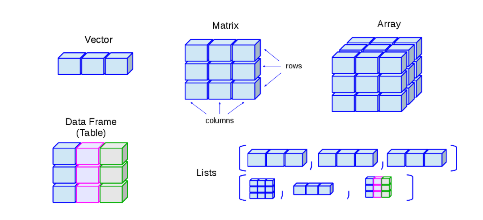
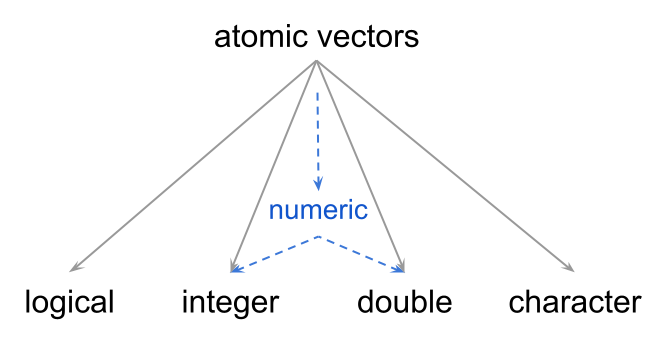

### R data type 과 structure

모든 프로그래밍 언어는 메모리에 저장된 데이터를 사용할 수 있는 고유의 방식이 있습니다. R에서는 메모리에 저장하거나 메모리에서 읽어 올 수 있는 모든 데이터 단위를 객체(objects) 라고 부르며 데이터 타입에 따라 메모리에 저장되는 방식이 다릅니다. R에서 각 데이터들은 하나의 data type을 가지고 있으며, 기본적인 데이터 타입 (typeof 함수로 확인할 수 있습니다)에는

integer

double

charactor

logical

...... 가 있습니다.

한편으로 R은 그 전신인 S 언어와의 호환을 위해서 data mode 값도 가지고 있습니다. mode의 종류는

numeric (integer와 double의 합쳐서)

charactor

logical

...... 가 있습니다.

R에서는 data type과 mode를 혼용하여 사용하고 있습니다. 예시로 data type을 변환하는 함수 중 as.numeric()이 있는데 double type으로 강제변환 시킵니다.

R에서는 데이터구조를 위해 vecter와 list란 개념을 사용하는데 같은 데이터 타입으로 구성된 1차원 구조응 vector라 하고, 2차원 구조는 matrix, 3차원 구조는 array가 됩니다. 데이터타입이 다르면 리스트가 됩니다. 데이터프레임은 2차원이지만 컬럼별로 데이터 타입이 다른 경우로 대부분의 엑셀자료에 해당합니다.

vector 중에서 element가 하나인 것을 atomic vector라 할 수 있는데 예시는 아래와 같습니다.

