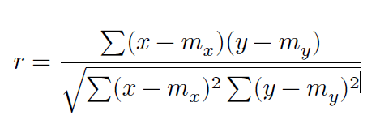
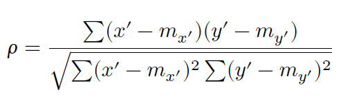
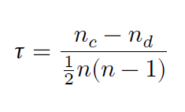
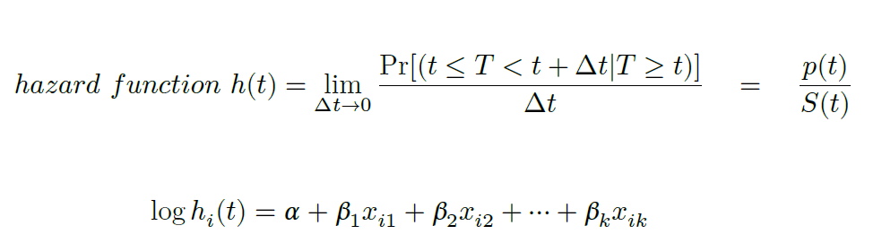

# Built-in Data sets in R

소개 및 개요 : R에는 내장된 데이터세트가 있다. 테스트용, 교육용 및
연습용으로 이러한 데이터세트를 사용하면 좋다.

-   사용법

```{r volcano}
data("volcano") ## built-in dataset 중에서 volcano 사용 
library(survival) 
data(package="survival") ## survival package에 어떤 데이터 세트들이 있는지 확인 
data(cancer) ## data(cancer, package="survival") 와 같이 사용해도 된다. 
str(lung) ## cancer dataset에는 다양한 암종류의 생존분석용 데이터가 들어가 있다.
```

-   rotterdam : breast cancer dataset in survival package

```{r moonbook}
library(moonBook) 
mytable(grade~. , data=rotterdam)
```

```{r mytable}
# suppressMessages(library(dplyr)) 
# mytable(grade~. , data=rotterdam) %>% mylatex() %>% cat}
```

LaTeX을 이용하여 깔끔한 논문형식의 테이블을 만들 수 있는 방법은 위
코드를 실행시킬 수 있게 되면 다음에 소개하겠다.

# Basic statistics functions

## t-test

R function : t.test -

option arguments : alternative = c(“two.sided”, “less”, “greater”),
formula (종속변수\~ 독립변수)

help files : ?t.test 를 치면 함수의 argument, values(results), detail에
대해서 설명이 나옴

```{r rotterdam}
group1 <- rotterdam[ rotterdam$grade == 2, "age"]
group2 <- rotterdam[ rotterdam$grade != 2, "age"]
t.test(group1, group2) ## unmatched 임의의 두개의 vector로 비교
```

```{r ttest}
t.test(age~meno,data=rotterdam) ## matched 한개의 데이터프레임에서 paired t-test
```

## 𝜒2 (chi-square) test

R function : chisq.test

```{r table}
table(rotterdam[,c("hormon","size")])
```

```{r chitesttalbe}
chisq.test(table(rotterdam[,c("hormon","size")]), correct = TRUE)
```

```{r chitest}
chisq.test(rotterdam$hormon, rotterdam$chemo)
```

```{r matrix}
x <- matrix(c(12, 5, 7, 7), ncol = 2) ## matrix를 만들어서 검정하는 방법
x
```

```{r pvalue}
chisq.test(x)$p.value ## chisq test의 결과물은 list이다 여기서 p.value 부분만 출력
```

```{r pvalue2}
chisq.test(x, simulate.p.value = TRUE, B = 10000)$p.value
```

## Generalized linear regression and Loess smoothing (LOcal regrESSion)

R function : glm (generalized linear models) 다중 선형회귀

```{r economics}
suppressMessages(library(ggplot2))
data(economics, package="ggplot2")
economics$index <- 1:nrow(economics) # create index variable
glm_model1 <- glm(psavert~pop, data = economics)
summary(glm_model1)
```

```{r anova}
anova(glm_model1)
```

```{r plot}
plot(glm_model1)
```

```{r eco-graph, eval=FALSE}
# 데이터 선택
economics <- economics[100:180, ]  # 좁은 범위 선택

# Loess 모델 생성
loessMod10 <- loess(uempmed ~ index, data=economics, span=0.10)  # 10% smoothing span
loessMod25 <- loess(uempmed ~ index, data=economics, span=0.25)
loessMod50 <- loess(uempmed ~ index, data=economics, span=0.50)

# 예측값 계산
smoothed10 <- predict(loessMod10)
smoothed25 <- predict(loessMod25)
smoothed50 <- predict(loessMod50)

# 그래프 그리기
plot(economics$date, economics$uempmed, type="l", main="Loess Smoothing and Prediction", xlab="Date", ylab="Unemployment Median")

# 예측된 smoothed 라인 추가
lines(economics$date, smoothed10, col="red")
lines(economics$date, smoothed25, col="green")
lines(economics$date, smoothed50, col="blue")

```

위 코드가 제 개발환경에서 실행시 오류가 발생하므로 추후 수정해서 올려
드리겠습니다.

```{r eco-graph2, output='hide'}
economics <- economics[1:58,]
library(ggplot2)
ggplot(data=economics, aes(x=index, y=uempmed))+
geom_point()+
geom_smooth(method = "lm")
```

## One-way ANOVA

```{r plantgrowth}
suppressMessages(library(psych))
PlantGrowth ## 내장 dataset
```

```{r boxplot}
plot(weight~group, data = PlantGrowth) ## Boxplot으로 자동으로 그려준다.
```

```{r with}
with(PlantGrowth, describeBy(weight,group))
```

```{r bartlett}
bartlett.test(PlantGrowth$weight ~ PlantGrowth$group) ## 등분산 가정을 체크함
```

```{r aov}
aov_model <- aov(weight~group, data = PlantGrowth)
summary(aov_model)
```

## Correlation tests

Pearson correlation formula



Spearman correlation formula : non-parametric



where 𝑥′ = 𝑟𝑎𝑛𝑘(𝑥) and 𝑦′ = 𝑟𝑎𝑛𝑘(𝑦)

Kendall correlation formula : non-parametric



where 𝑛𝑐 : number of concordant pairs, 𝑛𝑑 : number of concordant pairs,
𝑛 : size of 𝑥 + 𝑦

```{r cor}
res <- cor.test(economics$index, economics$uempmed, method = "pearson")
res
```

```{r pvalue3}
res$p.value ## res는 리스트형태로 나오는 결과물이다. 여기에서 필요한 값만 골라냄
```

```{r estimate}
res$estimate
```

```{r result2}
res2 <- cor.test(economics$index, economics$uempmed, method = "spearman")
res2
```

```{r result3}
res3 <- cor.test(economics$index, economics$uempmed, method = "kendall")
res3
```

## Survival analysis

-   Kaplan Meier Analysis - Basic survival model survival::Surv

```{r surv}
km <- Surv(rotterdam$dtime, event = rotterdam$death) ## default type : "right"
plot(km) ## km - Surv class (time, status) 가지고 있는 리스트
```

```{r median}
median(km); mean(km) ## Surv 객체에 대한 method 함수들이 있다. plot.Surv포함
```

-   Kaplan Meier Analysis - survfit model km\_

```{r fit}
km_fit <- survfit(km~rotterdam$meno)
summary(km_fit, c(365*1:19)) ### 정해진 time에 맞는 생존테이블표를 만든다.
```

```{r ggsurvplot, warning=FALSE, output='hide'}
suppressMessages(library(survminer))
plot(km_fit, col = rainbow(2), lty=1:2)
legend("topright", legend = c("Menopause(-)","Menopause(+)"),
       col= rainbow(2), lty=1:2)
library(survminer)
ggsurvplot(km_fit, data = rotterdam,
           conf.int = T, xscale = 365.2425, ## xscale can be "d_y"
           break.x.by = 5*365.2425,
           pval = T, pval.size =4, surv.median.line = "hv",
           risk.table = FALSE, ## if TRUE, risk table is displayed under graph
           legend.title="Menopause", legend.labs=c("No","Yes"),
           palette = c("#E7B800", "#2E9FDF"),)
```

```{r ggsurvplot2, eval=FALSE}
## ggplot + survminer package
```

Cox Proportional model



```{r args}
args(coxph)
```

```{r Rossi}
library(carData) ## Rossi data set 이용하기 위해서 사용
suppressMessages(library(car)) ## Anova function
colnames(Rossi) # emp1-52 : factor (yes or no)
```

```{r cox_model}
cox_model1 <- coxph(Surv(week, arrest) ~
fin + age + race + wexp + mar + paro + prio,
data = Rossi)
summary(cox_model1)
```

```{r Anova_cox1}
Anova(cox_model1)
```

```{r anova_cox1}
anova(cox_model1)
```

모델의 전체적인 생존곡선을 알고 싶으면 survfit 함수를 이용해서
생존곡선을 그릴 수 있다

```{r plot_surivival}
plot(survfit(cox_model1), ylim = c(0.6,1),xlab = "weeks",
ylab = "Proportion not rearrested")
```

```{r modified}
Rossi.fin <- with(Rossi, data.frame(fin=c(0, 1),
age=rep(mean(age), 2), race=rep(mean(race == "other"), 2),
wexp=rep(mean(wexp == "yes"), 2), mar=rep(mean(mar == "not married"), 2),
paro=rep(mean(paro == "yes"), 2), prio=rep(mean(prio), 2)))
## fin = 0,1 이것을 두그룹으로 나누고 나머지 변수들은 평균적인 값으로 고정해 버림
plot(survfit(cox_model1, newdata = Rossi.fin), conf.int = T,
lty = c(1,2), ylim = c(0.6,1),xlab = "weeks",
ylab = "Proportion not rearrested", col = c("blue","red")
)
legend("bottomleft", legend=c("fin = no", "fin = yes"), lty=c(1 ,2),
col=c("blue","red") , inset=0.02)
```
