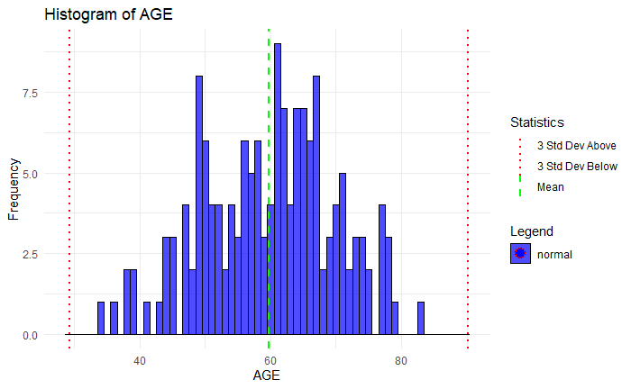
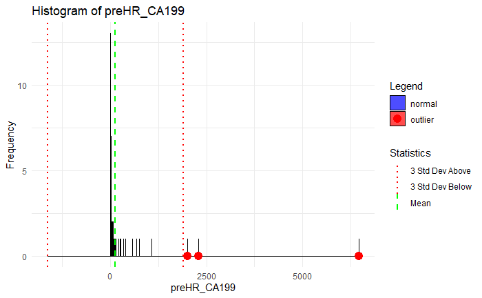
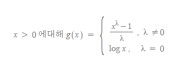
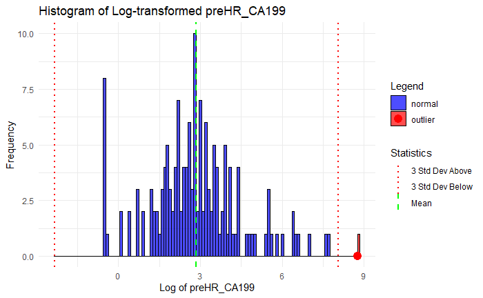

### **결측치의 처리**

### 연속형변수 이상치(outlier) 검출

#### Z -점수 방법

데이터가 정규분포를 보인다면 평균으로부터 3 표준편차 이상 떨어져 있으면 이상치로 판단할 수 있습니다. 아래는 제가 만든 시각화의 예시입니다. 히스토그램에 평균과 3 표준편차를 표시하고, 이상치를 붉은색 원으로 표시해 보았습니다 (소스코드는 프로젝트 원격저장소 my_funtions.R 파일 안에 my_histogram_for_outlier_detection 함수로 만들어 두었습니다.)

{fig-align="center" width="700"}

{fig-align="center" width="700"}

위쪽은 나이 데이터를 히스토그램으로 만든 것이며 이상치가 보이지 않는 경우입니다. 아래쪽은 종양표지자 CA 19-9를 히스토그램으로 만든 것이며 빨간원으로 표시된 이상치가 3개 있는 경우입니다.

#### 정규분포로의 변환

**박스-콕스 변환(Box-Cox Transformation)은** 정규분포가 아닌 데이터를 다음의 식을 이용하여 정규분포에 가깝게 변환시켜 줍니다.

박스-콕스 변환을 취하기 위해서는 데이터가 모두 양수여야 된다는 조건이 필요하며 보통 원 데이터의 최소값이 양수가 되도록 어떤 값을 더하는 shift주는 식으로 해결할 수 있습니다 (<https://blog.naver.com/pmw9440/221713858254>). 특정 데이터의 최적의 정규화 식을 찾는 과정은 최적의 λ 을 찾는 것이라 할 수 있습니다. 여기서 특기할만한 λ 의 값은 0, 1 인데, λ = 0이면 log(x) 로그변환을 의미하고 λ = 1이면 g(x) = x-1이 되므로 이는 항등변환과 같게 됩니다.

위의 그림에서와 같이 CA 19-9 측정값은 정규분포를 보이지 않으므로 정규분포로 변환 후 히스토그램을 그리면 아래와 같습니다.

{width="700"}

x축을 로그를 취하니 정규분포모양이 되었으며 이상치도 1개로 감소되었습니다.
